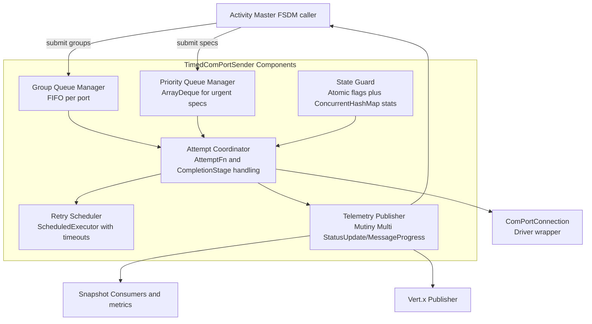

```mermaid
graph TD
  ActivityMasterFsdm[Activity Master FSDM caller]
  Connection[ComPortConnection\nDriver wrapper]
  VertxPublisher[Vert.x Publisher]
  SnapshotConsumers[Snapshot Consumers and metrics]

  subgraph TimedSenderEngine [TimedComPortSender Components]
    PriorityQueue[Priority Queue Manager\nArrayDeque for urgent specs]
    GroupQueue[Group Queue Manager\nFIFO per port]
    AttemptCoordinator[Attempt Coordinator\nAttemptFn and CompletionStage handling]
    Scheduler[Retry Scheduler\nScheduledExecutor with timeouts]
    TelemetryPublisher[Telemetry Publisher\nMutiny Multi StatusUpdate/MessageProgress]
    StateGuard[State Guard\nAtomic flags plus ConcurrentHashMap stats]
  end

  ActivityMasterFsdm -->|submit specs| PriorityQueue
  ActivityMasterFsdm -->|submit groups| GroupQueue
  GroupQueue --> AttemptCoordinator
  PriorityQueue --> AttemptCoordinator
  AttemptCoordinator --> Scheduler
  StateGuard --> AttemptCoordinator
  AttemptCoordinator --> Connection
  AttemptCoordinator --> TelemetryPublisher
  TelemetryPublisher --> ActivityMasterFsdm
  TelemetryPublisher --> SnapshotConsumers
  TelemetryPublisher --> VertxPublisher
```
