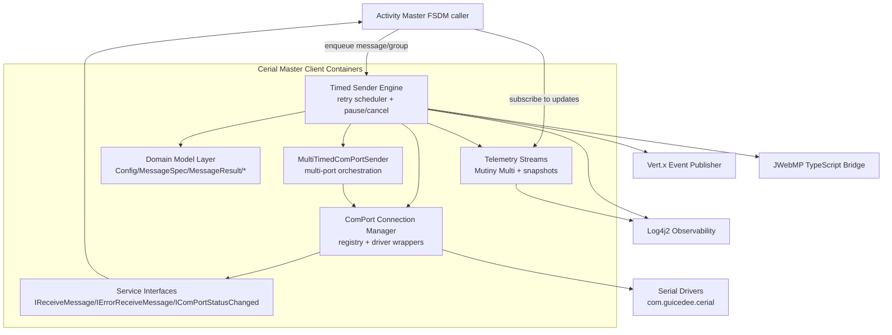

```mermaid
graph TD
  ActivityMasterFsdm[Activity Master FSDM caller]
  SerialDrivers[Serial Drivers\ncom.guicedee.cerial]
  VertxPublisher[Vert.x Event Publisher]
  Logging[Log4j2 Observability]
  TypescriptBridge[JWebMP TypeScript Bridge]

  subgraph CerialClientBoundary [Cerial Master Client Containers]
    Engine[Timed Sender Engine\nretry scheduler + pause/cancel]
    Manager[MultiTimedComPortSender\nmulti-port orchestration]
    Connection[ComPort Connection Manager\nregistry + driver wrappers]
    Domain[Domain Model Layer\nConfig/MessageSpec/MessageResult/*]
    Telemetry[Telemetry Streams\nMutiny Multi + snapshots]
    ServiceHooks[Service Interfaces\nIReceiveMessage/IErrorReceiveMessage/IComPortStatusChanged]
  end

  ActivityMasterFsdm -->|enqueue message/group| Engine
  ActivityMasterFsdm -->|subscribe to updates| Telemetry
  Engine --> Manager
  Engine --> Connection
  Manager --> Connection
  Engine --> Domain
  Engine --> Telemetry
  Connection --> ServiceHooks
  ServiceHooks --> ActivityMasterFsdm
  Connection --> SerialDrivers
  Engine --> Logging
  Telemetry --> Logging
  Engine --> VertxPublisher
  Engine --> TypescriptBridge
```
