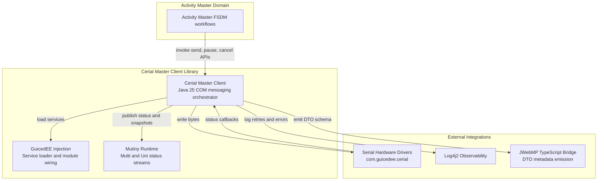

Trust boundaries: ActivityMaster workflows call into the client library boundary; serial hardware and TypeScript generation sit outside the library boundary and require validation and logging. Threat highlights include malformed COM payloads from hardware drivers and misconfigured service-loader modules; mitigate with Log4j2 audit trails, GuicedEE module checks, and Mutiny stream backpressure.
