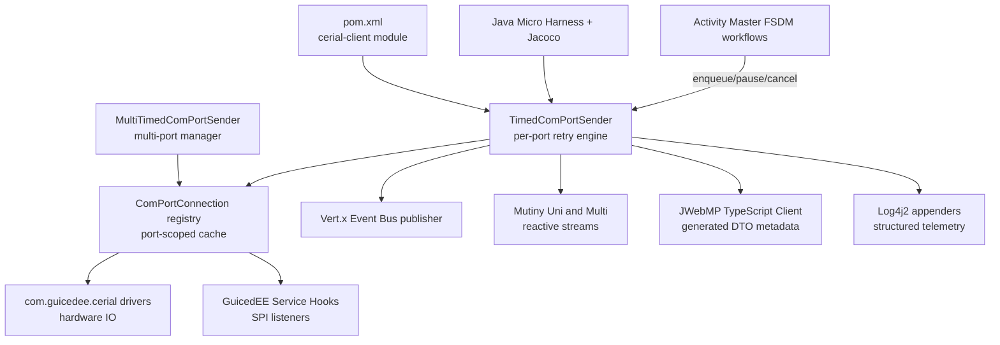

# Dependency and Integration Map

Trust boundaries: the ActivityMaster caller boundary feeds the library; SPI listeners and serial drivers are external and must be validated before participation; telemetry and TypeScript emission leave the boundary and rely on Log4j2 plus Mutiny backpressure to avoid untrusted input amplification.
