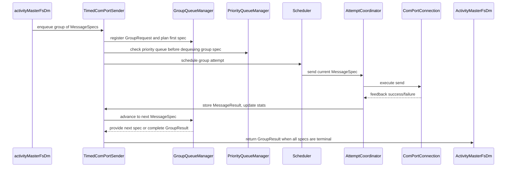

```mermaid
sequenceDiagram
activityMasterFsDm->>TimedComPortSender: enqueue group of MessageSpecs
TimedComPortSender->>GroupQueueManager: register GroupRequest and plan first spec
TimedComPortSender->>PriorityQueueManager: check priority queue before dequeuing group spec
TimedComPortSender->>Scheduler: schedule group attempt
Scheduler->>AttemptCoordinator: send current MessageSpec
AttemptCoordinator->>ComPortConnection: execute send
ComPortConnection-->>AttemptCoordinator: feedback success/failure
AttemptCoordinator->>TimedComPortSender: store MessageResult, update stats
TimedComPortSender->>GroupQueueManager: advance to next MessageSpec
GroupQueueManager-->>TimedComPortSender: provide next spec or complete GroupResult
TimedComPortSender->>ActivityMasterFsDm: return GroupResult when all specs are terminal
```
