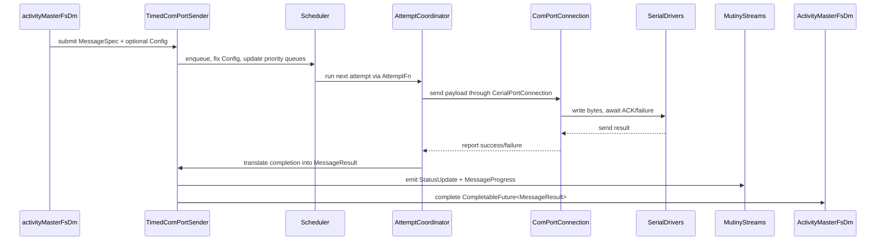

```mermaid
sequenceDiagram
activityMasterFsDm->>TimedComPortSender: submit MessageSpec + optional Config
TimedComPortSender->>Scheduler: enqueue, fix Config, update priority queues
Scheduler->>AttemptCoordinator: run next attempt via AttemptFn
AttemptCoordinator->>ComPortConnection: send payload through CerialPortConnection
ComPortConnection->>SerialDrivers: write bytes, await ACK/failure
SerialDrivers-->>ComPortConnection: send result
ComPortConnection-->>AttemptCoordinator: report success/failure
AttemptCoordinator->>TimedComPortSender: translate completion into MessageResult
TimedComPortSender->>MutinyStreams: emit StatusUpdate + MessageProgress
TimedComPortSender->>ActivityMasterFsDm: complete CompletableFuture<MessageResult>
```
